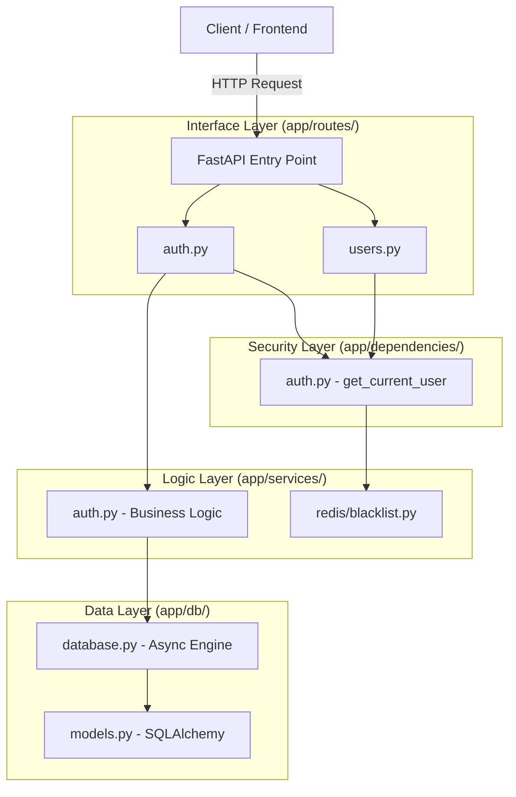

# Advanced Asynchronous Auth System: Project Documentation

This document provides a comprehensive guide to the **Enterprise Core Auth System**, detailing its architecture, file structure, and core execution workflows.

---

## 1. Project Overview
The system is a high-performance, non-blocking asynchronous security engine designed for low-latency authentication and real-time session management.

**Core Tech Stack:**
- **Framework**: FastAPI (Asynchronous Python)
- **Database**: SQLAlchemy 2.0 (Async) + aiosqlite
- **Security**: PyJWT (HS256), Passlib (Bcrypt)
- **Cache**: Redis (Async) for stateful token revocation
- **Testing**: Pytest-asyncio + HTTPX

---

## 2. System Architecture

The project follows a **Modular Clean Architecture**, separating the interface, business logic, and data layers.

---

## 3. Folder Structure & Role of Files

### 📁 `app/` (Root Package)
- **`main.py`**: The application heart. Registers all routes and manages the **Lifespan** (DB initialization).

### 📁 `app/core/` (System Foundation)
- **`config.py`**: Centralized configuration using `PydanticBaseSettings`. Manages dual-token secrets and DB URLs.
- **`security.py`**: Cryptographic core. Handles password hashing (Bcrypt) and JWT creation/validation (HS256).

### 📁 `app/db/` (Data Persistence)
- **`database.py`**: Sets up the Asynchronous engine and provides the `get_db` session dependency.
- **`models.py`**: Defines the `User` database schema with fields for email, hashed passwords, and active status.

### 📁 `app/schemas/` (Data Validation)
- **`user.py`**: Validation for registration and user profile responses.
- **`auth.py`**: Validation for Token Exchange and Standard message responses.

### 📁 `app/routes/` (API Interface)
- **`auth.py`**: Endpoints for `/register`, `/login`, `/logout`, and `/refresh`.
- **`users.py`**: Endpoints for user-specific data like `/me`.

### 📁 `app/services/` (Business Logic)
- **`auth.py`**: High-level logic for verifying credentials and orchestrating registration.

### 📁 `app/dependencies/` (Security Interceptors)
- **`auth.py`**: Contains the **Zero-Trust** interceptor (`get_current_user`) that validates every incoming request.

### 📁 `app/redis/` (Fast Memory Layer)
- **`blacklist.py`**: Implements stateful token invalidation to allow real-time logout.

---

## 4. Core Execution Workflows

### 🔄 1. Registration & Authentication
1.  **Request**: Client sends credentials to `/auth/login`.
2.  **Verification**: `auth_service` checks the database for the user and verifies the password hash via `security.py`.
3.  **Issuance**: Two separate JWTs are created:
    - **Access Token**: Short lifespan (15 min) for data access.
    - **Refresh Token**: Long lifespan (7 days) for session maintenance.
4.  **Attributes**: Tokens contain a `type` claim to prevent using a refresh token to access data.

### 🛡️ 2. Protected Resource Access (Zero-Trust)
1.  **Interception**: Every request to `/users/me` is intercepted by `get_current_user`.
2.  **Integrity**: The JWT signature is verified using the system's secret key.
3.  **State Check**: The system queries the **Redis Blacklist**. If the token is found, the request is rejected (401 Unauthorized) even if the token hasn't expired.
4.  **Injection**: The active user record is injected directly into the route function.

### 🛑 3. Session Revocation (Logout)
1.  **Trigger**: User calls `/auth/logout`.
2.  **Action**: The system extracts the token fingerprint and stores it in the Redis memory layer.
3.  **Result**: The token becomes "dead" across the entire enterprise instantly.

---

## 5. Continuous Quality Gate (CI/CD)
The project includes a `.github/workflows/main.yml` file that automates validation:
1.  **Linter**: Checks for PEP8 compliance.
2.  **Security Audit**: Uses **Bandit** to scan for hardcoded secrets or weak cryptography.
3.  **Async Tests**: Runs the `app/tests/` suite using `pytest-asyncio` to verify the E2E success sequence.

---

## 6. Development & Testing
- **Local Run**: `uvicorn app.main:app --reload`
- **Unit Testing**: `$env:PYTHONPATH = "."; pytest`
- **Environment**: Managed via `.env` file (see `.env.example`).
